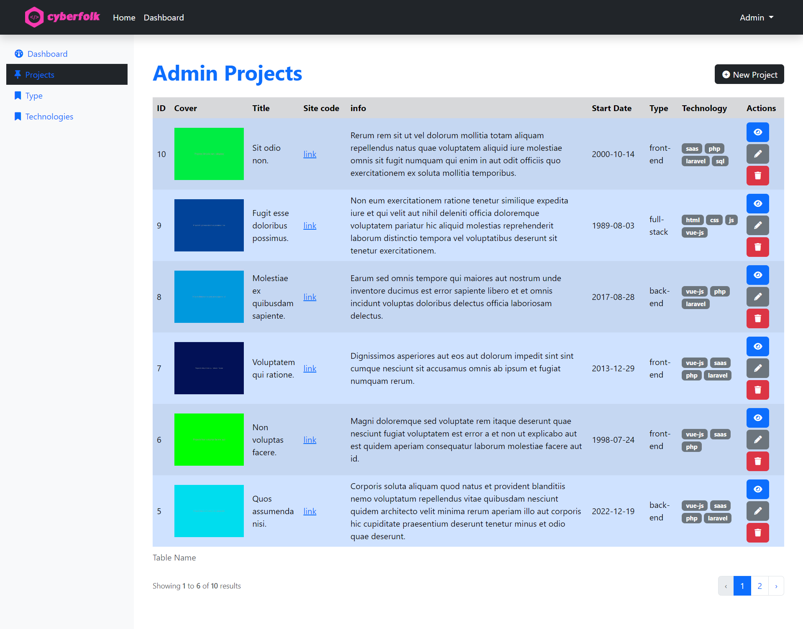
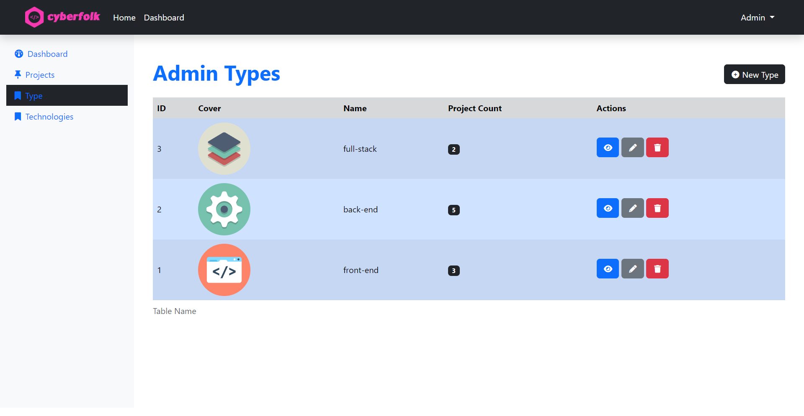
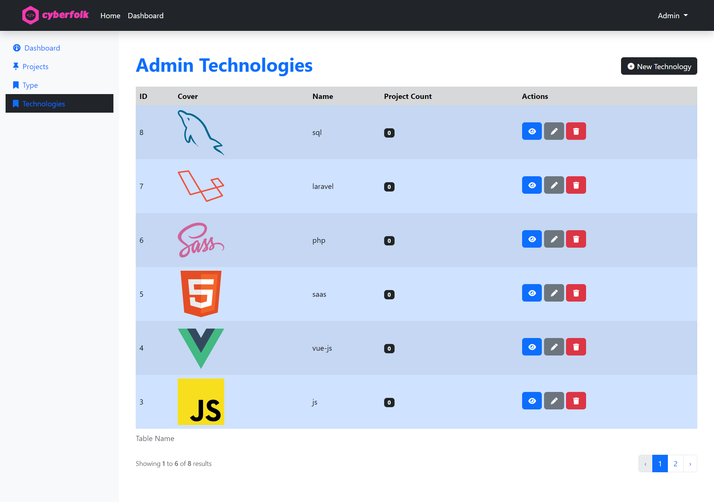

# Portfolio API

**Initial commit**: 05/06/23

**Tecnologie:** Laravel, Breeze , PHP, Blade, MySql, Javascript, HTML, CSS e Bootstrap.

⚙️ Ed ecco a voi la Dashboard-API del mio portfolio progetti, uno degli ultimI lavori fatti per boolen

Si tratta di una piattaforma back-end per raccogliere i dati dei miei progetti. Interagisce direttamente con un database sql gestendo i dati tramite operazioni CRUD. Con l'utilizzo del API/ProjectController potrà rispondere alle chiamate API restituendo i dati in formato json. Ci sono tante altre funzionalità interessanti come l'autenticazione tramite breeze, la capacità di gestire email appaggioandosi alla risorsa esterne mailtrap, e la possibilità di mettere un tag e la lista delle tecnologie ai singoli progetti utilizzando relazioni many-tomany e one-to-many.

🔗 Repository:
https://github.com/cyberfolk/laravel-api



## Milestone:

-   Ho installato i pacchetti **laravel/breeze** ed **pacificdev/laravel_9_preset**.
-   Ho creato il modello `Project` con relativa `migrazione`, `seeder`, `controller` e `rotte`
-   Ho creato un resource controller `Admin\ProjectController` che mi permette di gestire tutte le operazioni CRUD sui `Project`.
-   Ho validato i dati dei `Project` nelle operazioni CRUD usando dei form requests.
-   Ho utilizzato **bootstrap** per il Layout admin.

### One-to-many

Ho aggiunto una nuova entità `Type`, questa entità rappresenta la tipologia di progetto ed è in relazione one to many con i progetti.

-   Ho creato il modello `Types` con relativa `migrazione`, `seeder`, `controller` e `rotte`.
-   Ho creato una migration per modificare la tabella `projects` aggiungendo la chiave esterna.
-   Ho aggiunto ai model `Type` e `Project` i metodi per definire la loro relazione one to many.
-   Nella pagina per mostrare i dettagli di un progetto ho mostrato la tipologia associata, se presente.
-   Nella pagina di creazione e modifica di un progetto ho implementato la possibilità di aggiungere una tipologia al progetto
-   Ho gestito il salvataggio dell’associazione progetto-tipologia con opportune regole di validazione.
-   Ho aggiunto le operazioni CRUD per il model Type, in modo da gestire le tipologie di progetto direttamente dal pannello di amministrazione.

  


### Many-to-many

Ho aggiunto una nuova entità `Technology`, questa entità rappresenta le tecnologie utilizzate ed è in relazione many-to-many con i progetti.
I task da svolgere sono i medesimi del punto precedente.




### File Storage

Ho implementato la funzionalità di caricare dei file creando un symlink con l’apposito comando artisan `php artisan storage:link`, ho poi aggiunto l’attributo `enctype="multipart/form-data"` ai form di creazione e di modifica, oltre a modificare il file `filesystems.php` e il` .env` per l'uso del disco public.

### API

Ho aggiunto il controller `API/ProjectController`, il quale risponderà alle richieste API restituendo in formato json i dati relativi ai progetti presenti nel database.

### Mailtrap

Sfruttando il servizio [Mailtrap](https://mailtrap.io/) ho implementato una funzione che dalla rotta `contact-me` del front-end è possibile inviare una mail che verrà salvata direttamente nel database

### ProjectSeeder Fix

Si potrebbe verificare un errore con la generazione delle immagini fake nel seeder.
Per risolverla occorre modificare il file [image.php](vendor\fakerphp\faker\src\Faker\Provider\Image.php) dentro il modulo vendor di `faker` come indicato [qui](https://stackoverflow.com/questions/67415815/images-from-phpfaker-got-deleted-when-stored-in-storage-app-public-news-folder) e [qui](https://laracasts.com/discuss/channels/laravel/using-faker-to-fake-images-always-returns-false).

Percorso del file da modificare: `vendor\fakerphp\faker\src\Faker\Provider\Image.php`

```php
curl_setopt($ch, CURLOPT_FILE, $fp); //existing line
curl_setopt($ch, CURLOPT_SSL_VERIFYHOST, false);//new line
curl_setopt($ch, CURLOPT_SSL_VERIFYPEER, false);//new line
$success = curl_exec($ch) && curl_getinfo($ch, CURLINFO_HTTP_CODE) === 200; //existing line
```
